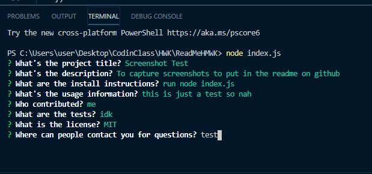

  # Project Title:  Good README Generator

  ## Description: 
  A generator that helps the user create a decent README

  ## Table of Contents

  * [Installation](#installation)
  * [Usage](#usage)
  * [License](#license)
  * [Contributing](#contributors)
  * [Tests](#tests)
  * [Questions](#questions)

  ## Installation
  1- Run node index.js   2-Answer the questions    3-Profit
  

  ## Usage
  N/A

   ## License
  MIT
  

   ## Contributors
  N/A

  ## Test
  N/A
    
   ## Questions
  mar0099887@gmail.com

